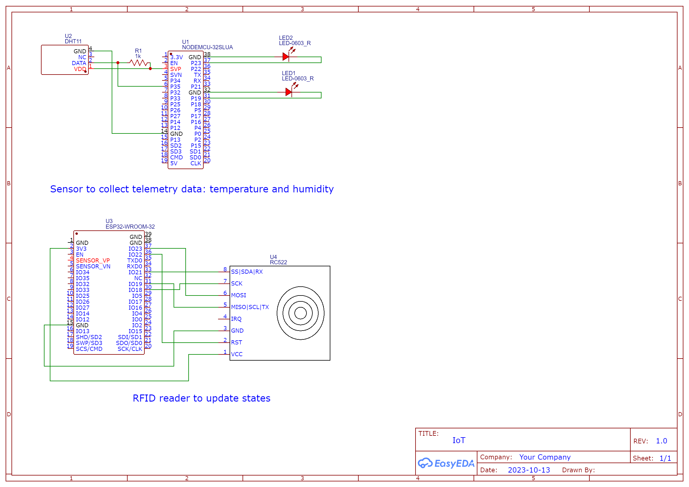

# Trustworthy Food Supply Chain
## Introduction
This GitHub repository is part of my bachelor's thesis, titled **"Towards a Trustworthy Food Supply Chain."** In this project, we focus on the hardware aspect of the supply chain monitoring system. Our goal is to ensure the security and reliability of the food supply chain. We achieve this by implementing two key components:

1. **Changing States Simulation**: In this section, we employ an ESP32 board in conjunction with an RFID-reader to simulate the various stages that a cargo might go through in the supply chain. At the conclusion of each step, an RFID card is used to notify both the ThingsBoard platform and our Hyperledger API that the cargo's state has been updated. This process helps maintain the integrity and transparency of the supply chain. The implementation is available in `iot_rfid.ino`.

2. **Reading and Logging Sensor Data**: To replicate real-world conditions, we utilize a DHT11 sensor to monitor temperature and humidity in the environment. This data is transmitted to both Hyperledger and ThingsBoard. Within the ThingsBoard platform, we create a rule chain to detect and respond to any anomalies or alerts. Simultaneously, the data is sent to a logging server, where it is stored on an Elasticsearch node for future analysis and aggregation. The implementation is available in `observer.ino`.

## How to Run?
Before you can compile and deploy the code, make sure to install the necessary libraries:
#### Install Requirements
- ArduinoJSON: This library is essential for handling JSON data.
- MFRC522: The MFRC522 library is required for working with the RFID reader.
You can install these libraries using the Arduino Library Manager. Open the Arduino IDE, go to "Sketch" -> "Include Library" -> "Manage Libraries," and then search for and install the libraries mentioned above.

#### Replace Placeholders
Change the following literals to your desired:
- WIFI_SSID
- WIFI_PASSWORD
- thingsBoardBasePath
- DEVICE_ID
- HyperLedgerBasePath
- ASSET_ID
- HL_ORG_USERNAME
- HL_ORG_PASSWORD
- BackendPath

#### Hardware Setup
Ensure that you set up your hardware as specified in the accompanying diagrams or documentation. Connect the components to your ESP32 board and the DHT11 sensor according to your specific configuration.

#### Compile and Deploy
Use the Arduino IDE to compile and upload the code to your ESP32 and ESP8266 board.